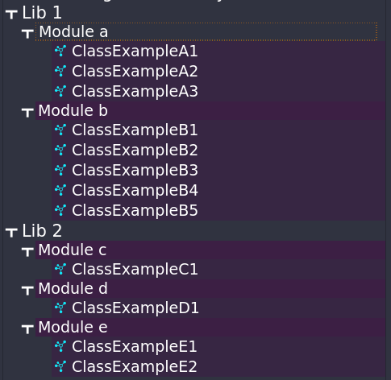
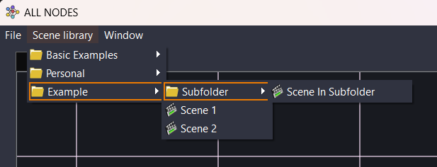
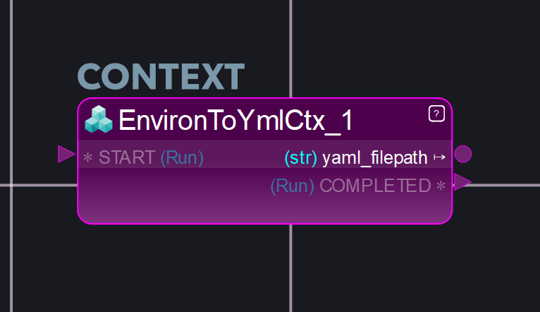
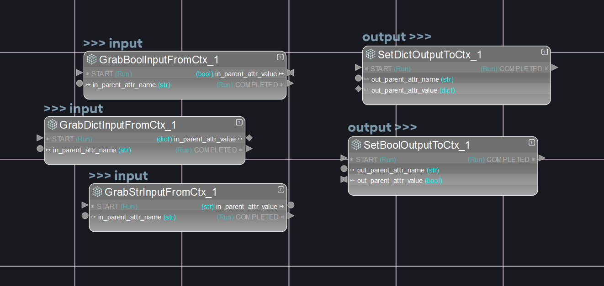
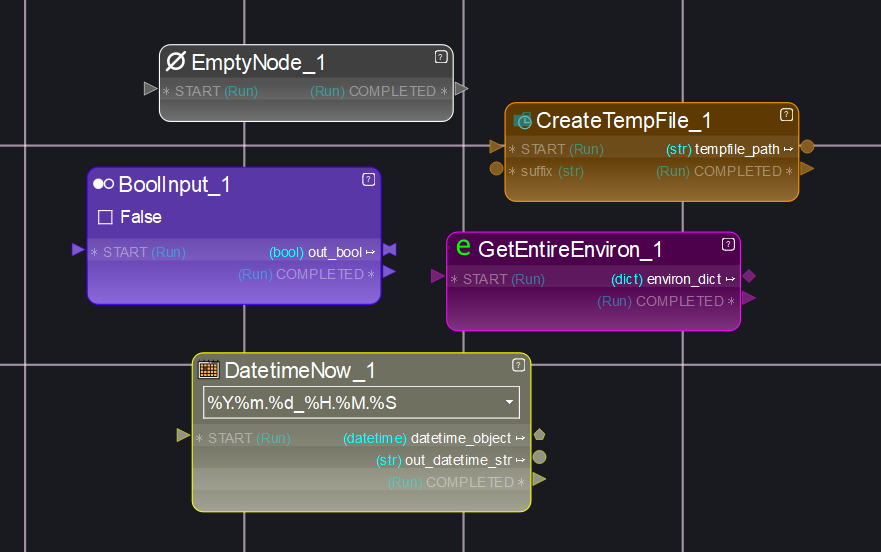
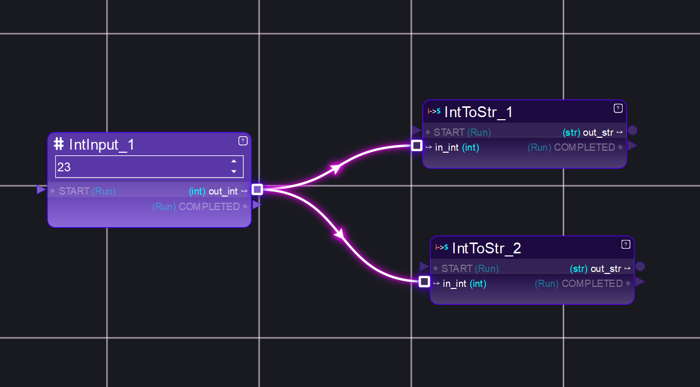
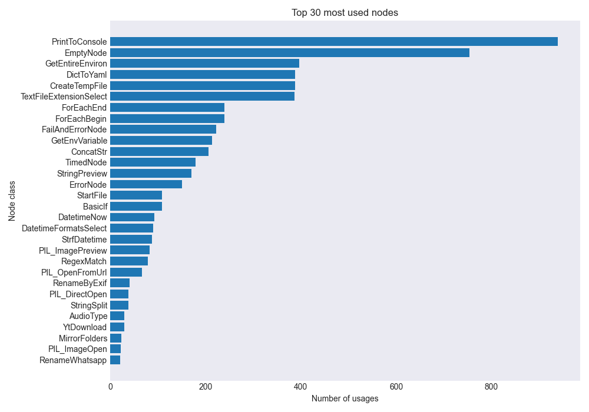
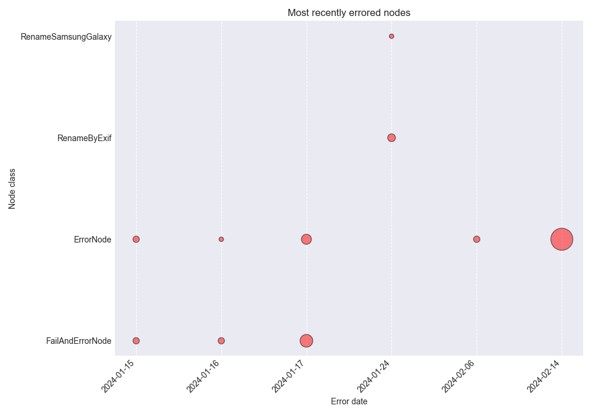
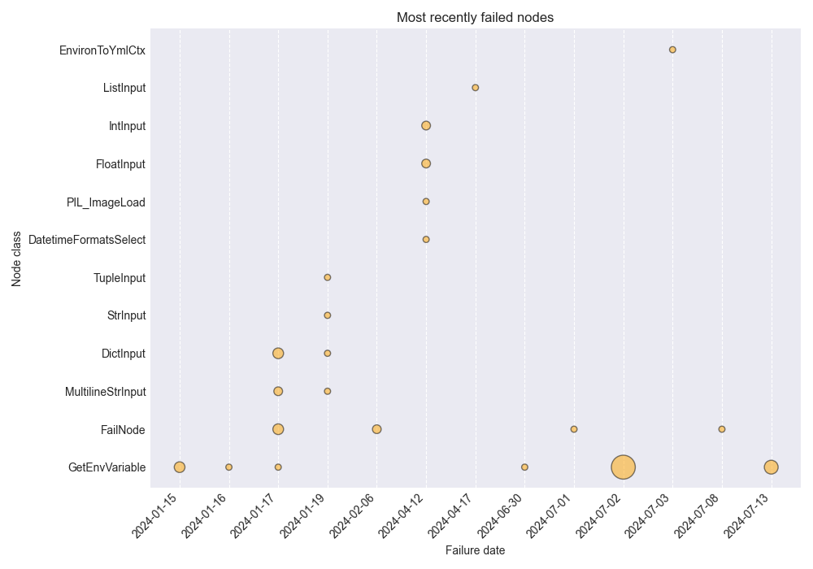

<h1 align="center">
    <br>
    <a href=https://github.com/jaimervq/all_nodes/actions/workflows/tests.yml> 
         
    </a>
    <a href=https://opensource.org/licenses/MIT> 
         
    </a>
    <a href=https://github.com/astral-sh/ruff> 
         
    </a>
    
</h1>
<h3 align="center">
    <a href=https://github.com/jaimervq/all_nodes?tab=readme-ov-file#-features>Features</a> • 
    <a href=https://github.com/jaimervq/all_nodes?tab=readme-ov-file#-how-to>How to</a> • 
    <a href=https://github.com/jaimervq/all_nodes?tab=readme-ov-file#%EF%B8%8F-execution-logic>Execution logic</a><br><br>
    <br>   
</h3>

**all_nodes** is a visual programming node editor designed to be used in the most flexible way possible.
It also aims to prevent re-duplication and re-writing of code inside of a project, as well as making debugging easier with its one-node-at-a-time approach to execution.

# 💡 Features
<table align="center">
  <tr>
    <td>✅ Drag and drop creation of nodes<br></td>
    <td>✅ Class search (<tt>/</tt> key)</td>
  </tr>
  <tr>
    <td align="center"></td>
    <td align="center"></td>
  </tr>
  <tr> 
      <td>✅ Visual feedback of execution</td>
      <td>✅ Execution in separate thread</td>
  </tr>
  <tr>
    <td align="center"></td>
    <td align="center"></td>
  </tr>
  <tr> 
      <td>✅ Preview of images and other elements</td>
      <td>✅ Attribute editor</td>
  </tr>
  <tr>
    <td align="center"></td>
    <td align="center"></td>
  </tr>
  <tr> 
      <td>✅ Deactivation of nodes</td>
  </tr>
  <tr>
    <td align="center"></td>
  </tr>
</table>


# 📖 How to
## Adding more classes/nodes
The places where all_nodes will search for node classes, scenes, etc is defined by the environment variable `ALL_NODES_LIB_PATH`

## Folder structure example
Example of organization of a folder, that contains two libraries

| Folder structure             | Classes representation          | Scenes                       |
| ---------------------------- | ------------------------------- | ---------------------------- |
|  |  |  |

This folder has:

- A `*node_lib` named folder with node libraries, in this case 2 libraries: `lib_1` and `lib_2`. Inside each library we can have:

    - As many `py` modules as needed 
    - A `styles.yml` file to define default styles for these modules (default colors, icons...)
    - A `icons` folder for the classes contained in the modules

- A `*scene_lib` named folder with scenes saved in yaml format

## Defining a node
Inside each module, nodes/classes can be defined as easy as this:

```python
class GetEnvVariable(GeneralLogicNode):
    
    NICE_NAME = "Get env variable"
    HELP = "Get the value of an environment variable, with possibility of a fallback" \
           "value if the variable is not defined"

    INPUTS_DICT = {
        "env_variable_name": {"type": str},
        "fallback_value": {"type": str, "optional": True},
    }

    OUTPUTS_DICT = {"env_variable_value": {"type": str}}

    def run(self):
        import os

        env_variable_name = self.get_attribute_value("env_variable_name")
        fallback_value = self.get_attribute_value("fallback_value")
        env_var_value = os.getenv(env_variable_name)
        if env_var_value is None:
            if fallback_value:
                env_var_value = fallback_value
            else:
                self.fail(
                    "No environment variable '{}' found".format(env_variable_name)
                )
                return

        self.set_output("env_variable_value", env_var_value)
```

Key elements that a node **MUST** have:
* A very unique name to itself, that cleary indicates what it does
* A `run` method

Key elements that a node **CAN** have:
* A `NICE_NAME` attribute, for this node to be displayed more readable
* A `HELP` attribute to explain how the node works
* The `INPUTS_DICT` dictionary, if the node needs inputs
* The `OUTPUTS_DICT` dictionary, if the node needs outputs
* The `INTERNALS_DICT` dictionary, if the node needs inputs/previews through GUI

Other considerations:
* The `import` statements are kept inside the run method, so no ImportError is met when editing nodes outside the software they are meant for.

## Defining a context


A context is a "node of nodes", or a node that contains a scene inside itself. To define it, just two ingredients are needed:
* As usual, a class in a .py file, with the **IS_CONTEXT** attribute set
* In the same folder as the .py file, a .ctx file (just a yaml file but with that extension instead) with the inner scene of the node

Once "inside" the context, its input attributes can be "grabbed" and its output attributes set by making use of the special ctx nodes:


## Defining a scene
Defining a scene is very easy, it is a simple and readable yaml file.

To look for scenes, all_nodes will:
* Examine each path defined in **ALL_NODES_LIB_PATH**
* Then in that path, will look for a folder that contains **"scene_lib"** in its name
* From that folder, will recursively scan for and add all .yml files found

Example of scene:
```yaml
# SCENE environ_to_yaml
# ---------------------
# Description: Simple scene to write the environ out to a yaml file

# Nodes section: overall list of nodes to be created
nodes:
- EnvironToYmlCtx_1:
    class_name: EnvironToYmlCtx
    x_pos: -904
    y_pos: -284
- StartFile_1:
    class_name: StartFile
    x_pos: -611
    y_pos: -304

# Connections section: connections to be done between nodes
connections:
- EnvironToYmlCtx_1.yaml_filepath -> StartFile_1.file_path


# Scene created at: 2023-01-24 23:13:10.371378
# Created by: jaime.rvq
```

The scene just needs two keys:
* **nodes**: with a list of nodes to be created
* **connections**: to establish the connections between the created nodes

Note how the `->` symbol is used to make the connections section more easily readable.

## Batch execution
Any .yml scene file can be executed in batch mode without the need to open the graphic editor.

This can be done by launching the main file and making use of the `-f` flag.

Example: `main.py -f D:/scene_examples/my_scene.yml`

Also, when a scene belongs to a repo/folder that has been defined in the **ALL_NODES_LIB_PATH** variable, it can be found just by its "alias". This alias is just the file name, with no need for the complete path or the ,yml extension.

Example: `main.py -f environ_to_yaml`

Finally, we can use the `-s` argument to set all the attributes we want to change in the scene prior to running. This flag accepts as many arguments as we need. Here is an example setting one node's attribute prior to running:

Example: `main.py -f environ_to_yaml -s OPEN_FILE.internal_bool true`

# ▶️ Execution logic
In a scene, the execution starts from nodes that are recognized as "starting nodes".
Those are nodes that:
* Have no dependency/inputs/connetions from others.
* Don't have any non-optional attributes not set



In these example nodes, none of them have any incoming connections. Also, the only input attribute they all have is the START attribute, but since it is an optional attribute, the node can start executing even if it is not set.
  
Another example:


The node has a non-optional input. It is not connected, but a value has been defined to it, so the node can start executing.

## Examples of execution order after the starting nodes
When a start node is executed, and it is successful, the nodes connected to its outputs will try to execute as well.
Have a look at this example:



What will happen is:
* IntInput_1 is executed
* It is successful, so its output value "out_int" is propagated to the connected nodes
* IntInput_1 now launches the execution of the connected nodes
* The connected nodes are executed in random order. This time it starts with IntToStr_1
* IntToStr_1 runs successfully
* IntToStr_2 is executed, runs successfully

However, changing the scene a little bit, makes things  more complex:


* IntInput_1 is executed
* It is successful, so its output value "out_int" is propagated to the connected nodes. Also, this time the "COMPLETED" attribute is propagated to the EmptyNode_1 connected node.
* IntInput_1 now launches the execution of the connected nodes
* The connected nodes are executed in random order. It has 3 connected nodes. This time it starts with IntToStr_2
* IntToStr_2 runs successfully
* IntToStr_1 is attempted to be executed, but has not recieved a value in its START attribute. It will not run now.
* EmptyNode_1 runs successfully. It propagates its COMPLETED value to IntToStr_1.
* EmptyNode_1 now launches the execution of its only connected node, IntToStr_1.
* IntToStr_1 now has all its connected inputs set, it can be executed. It runs successfully

## Create and run node networks on the fly
For simple setups and tests, node networks can be created and run at the same time in a python script.

🐍 Example:
```python
from all_nodes.logic.logic_scene import LogicScene
 
# Create a scene
logic_scene = LogicScene()

# Create a node and set one of its attributes
n_1 = logic_scene.add_node_by_name("GetEnvVariable")
n_1["env_variable_name"].set_value("USER")

# Create another node
n_2 = logic_scene.add_node_by_name("PrintToConsole")

# Connect the nodes
n_1["env_variable_value"].connect_to_other(n_2["in_object_0"])

# Run!
logic_scene.run_all_nodes()
```

# 📈 Analytics
Automatically generated once a month
(For personal use, they are not gathered from any other user)





